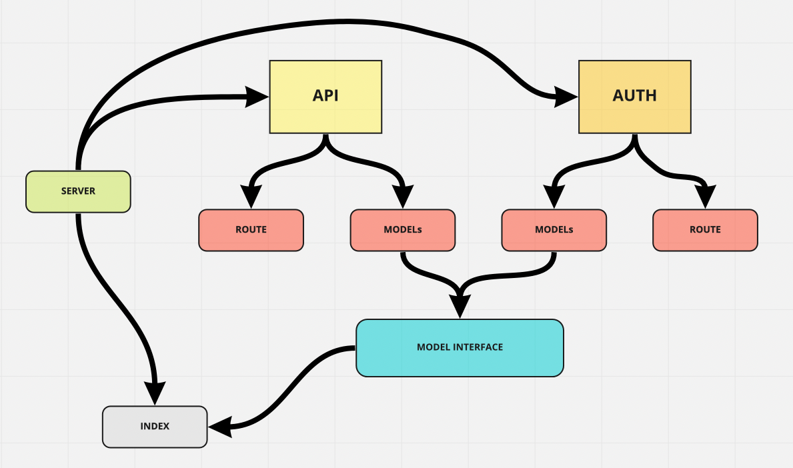

# auth-api

Created by Harvey Lucas

## Installation

```plaintext
> npm init -y
> npm install dotenv express jest supertest pg sequelize sequelize-cli sqlite3 base64 bcrypt cors jsonwebtoken morgan
```

## Summary of Problem Domain

### Lab: Class 08

#### Access Control

Implement Role Based Access Control (RBAC) using an Access Control List (ACL), allowing to not only restrict access to routes for valid users, but also based on the individual permissions we give each user.

## Links to application deployment

PR: https://github.com/tripppdx/auth-api/pull/2

## Visual



## Routes

```plaintext

- Path: POST /signup
- Path: POST /signin
- Path: GET /users
- Path: GET /secret
- Path: GET /api/v1/:model/
- Path: GET /api/v1/:model/:id
- Path: POST /api/v1/:model/
- Path: PUT /api/v1/:model/:id
- Path: DELETE api/v1/:model/:id
- Path: GET api/v2/:model/
- Path: GET api/v2/:model/:id
- Path: POST /api/v2/:model/
- Path: PUT api/v2/:model/:id
- Path: DELETE /api/v2/:model/:id


```
